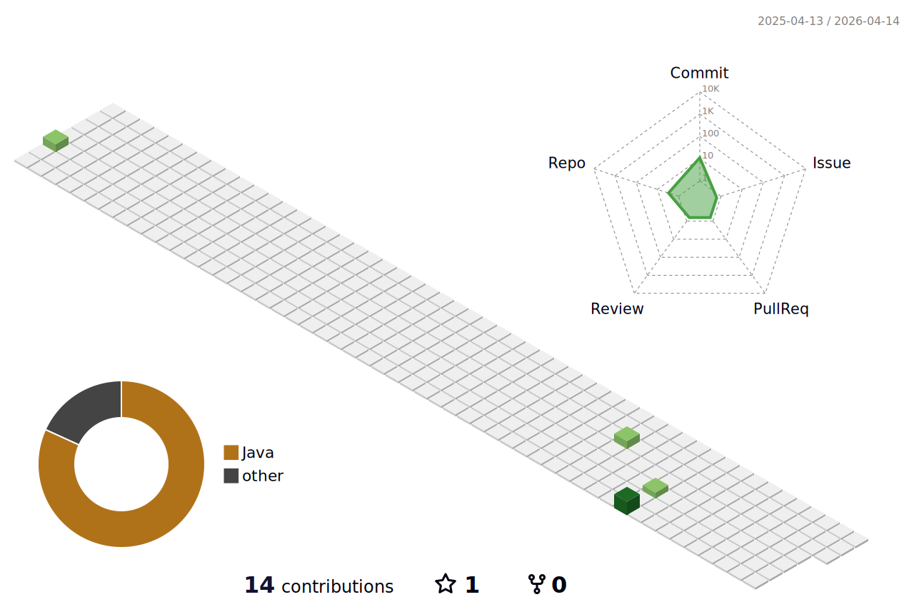
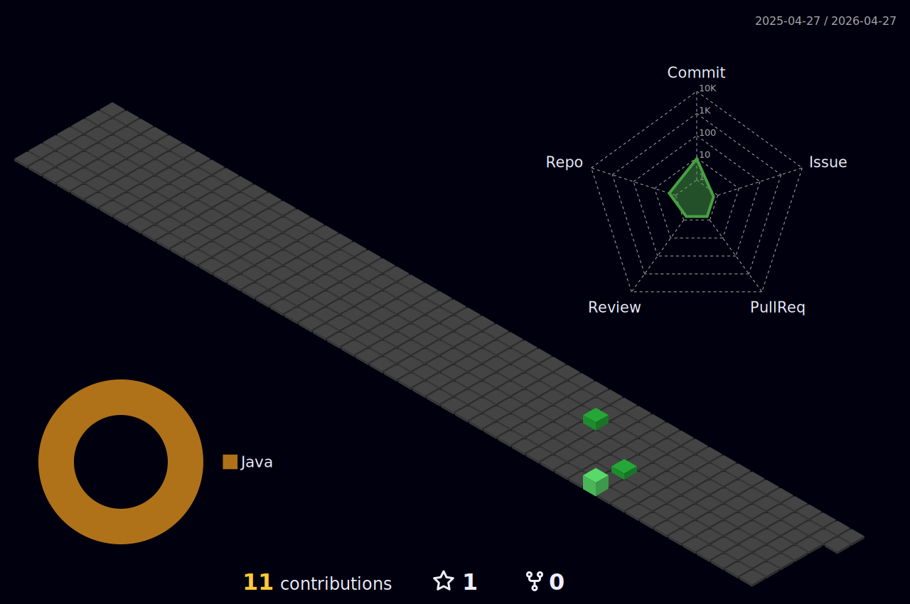

<!---
- 👋 Hi, I’m @rainofsilence
- 👀 I’m interested in ...
- 🌱 I’m currently learning ...
- 💞️ I’m looking to collaborate on ...
- 📫 How to reach me ...
--->

I'm a back-end developer from Earth who is determined to change the planet :)

Skills: JAVA / GO / MYSQL

About:
- 🔭 I’m currently working on @Futuretech
- 🌱 I’m currently learning Coding...
- 💬 Ask me about rainofsilence@foxmail.com
- 💡 Visit my blog <a href="https://rainofsilence.github.io">rainofsilence.icu</a>

Recent：

<!-- Light Mode -->

 

<!-- Dark Mode -->
<!---

--->

<!---
rainofsilence/rainofsilence is a ✨ special ✨ repository because its `README.md` (this file) appears on your GitHub profile.
You can click the Preview link to take a look at your changes.
--->
