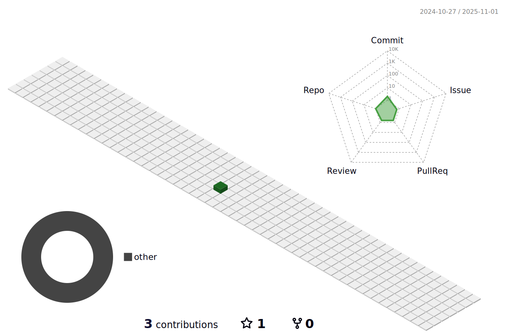

<!---
- 👋 Hi, I’m @rainofsilence
- 👀 I’m interested in ...
- 🌱 I’m currently learning ...
- 💞️ I’m looking to collaborate on ...
- 📫 How to reach me ...
--->

 

<!-- Light Mode -->

 

<!-- Dark Mode -->

 
<!---
rainofsilence/rainofsilence is a ✨ special ✨ repository because its `README.md` (this file) appears on your GitHub profile.
You can click the Preview link to take a look at your changes.
--->
